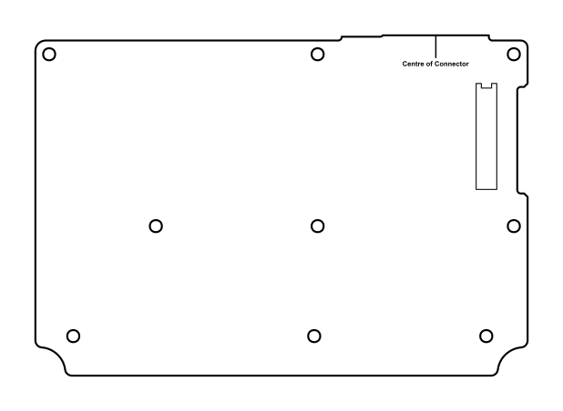

# Tait TM8100/8200 Options Board Dimensions

I've created an SVG of the Tait TM8100 and TM8200 Options Board Dimensions with a view of using it to create custom Options PCBs, and shared it here for posterity. 

Fortunately the drawings in the included "3DK Hardware Developer’s Kit Application Manual" PDF are to scale so it was just a case of converting it SVG, scaling it, and removing some of the cruft. 

I've not yet verified the fit by having a PCB manufactured, but all measurements match those documented in the PDF.





## License

`TM8100/TM8200 3DK Hardware Developer’s Kit Application Manual` is copyrighted by Tait Electronics Limited.

The SVG is released under the MIT License:

```Permission is hereby granted, free of charge, to any person obtaining a copy
of this software and associated documentation files (the "Software"), to deal
in the Software without restriction, including without limitation the rights
to use, copy, modify, merge, publish, distribute, sublicense, and/or sell
copies of the Software, and to permit persons to whom the Software is
furnished to do so, subject to the following conditions:

The above copyright notice and this permission notice shall be included in all
copies or substantial portions of the Software.

THE SOFTWARE IS PROVIDED "AS IS", WITHOUT WARRANTY OF ANY KIND, EXPRESS OR
IMPLIED, INCLUDING BUT NOT LIMITED TO THE WARRANTIES OF MERCHANTABILITY,
FITNESS FOR A PARTICULAR PURPOSE AND NONINFRINGEMENT. IN NO EVENT SHALL THE
AUTHORS OR COPYRIGHT HOLDERS BE LIABLE FOR ANY CLAIM, DAMAGES OR OTHER
LIABILITY, WHETHER IN AN ACTION OF CONTRACT, TORT OR OTHERWISE, ARISING FROM,
OUT OF OR IN CONNECTION WITH THE SOFTWARE OR THE USE OR OTHER DEALINGS IN THE
SOFTWARE.
```
